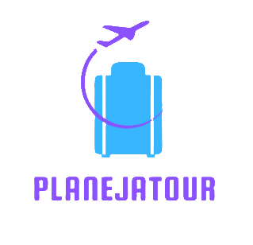

<h2>🎯 Objetivo do projeto</h2>

 O site precisa ter - página inicial, sobre , funcionalidades (com
conteúdo cadastrável e editável) e uma tela de contato. O conteúdo das páginas sobre e
funcionalidades deve ser consultado de uma API. Para realizar a edição e cadastro
serão criadas rotas /admin.
  
  
 <h2>Com essa proposta criamos o app : PLANEJATOUR🛬.</h2>
 
Somos uma empresa de tecnologia e inovação que hoje busca o seu espaço como plataforma de Planejamento de viagens! Com a missão de otimizar viagens por meio de tecnologia, conseguimos chegar cada vez mais longe, visando sempre otimizar também o tempo dos nossos viajantes. Afinal, não podemos nos esquecer do nosso princípio fundamental: libertar as pessoas de preocupações. Nisso, buscamos proporcionar aos clientes um momento de lazer e pausa na rotina, sem qualquer estresse.

 
 Para facilitar a vida do viajante, fazendo uma lista do que ele não pode esquecer em sua viagem.

 

 

<h2>🧾 O que é o CRUD
</h2>

CRUD são as quatro operações básicas do desenvolvimento de uma aplicação, sendo utilizadas em bases de dados relacionais fornecidas aos utilizadores do sistema.
 

<h2>🛠️ Ferramentas
</h2>

🖥️ Visual Studio Code 

📈 React

▶️ Npm 

🚀 Bootstrap

🤖 GitHub

🤓 Css3

💬 Kanban 

👨‍💻 Html 

 

<h2>✳️ Iniciando o projeto:
</h2>

>+ cd frontend
>+ npm install
>+ npm run dev

<h2>👥 Projeto desenvolvido pela squad composta por:
</h2>

<h1>🔗⛹Links da Equipe</h1>

<h2>Kesia:</h2>

 Linkdin - https://www.linkedin.com/in/kesiaribeiro/ 

Github - https://github.com/kesia8

<h2>Bernardo:</h2>

Linkdin - https://www.linkedin.com/in/bernardo-adelino-1a9335232/ 

Github -https://github.com/bedibe 
 

<h2>Silvia:</h2>

Linkdin - https://www.linkedin.com/in/silvia-corr%C3%AAa-b78197251 

Github - https://github.com/scorrea03

<h2>Ronald:</h2>

Linkdin - https://www.linkedin.com/in/ronald-da-silva-b70752248 

Github - https://github.com/Ronald-02 

<h2>Julia:</h2>

Linkdin - https://www.linkedin.com/in/juliaaraujodev/ 

Github -https://github.com/szya5 

